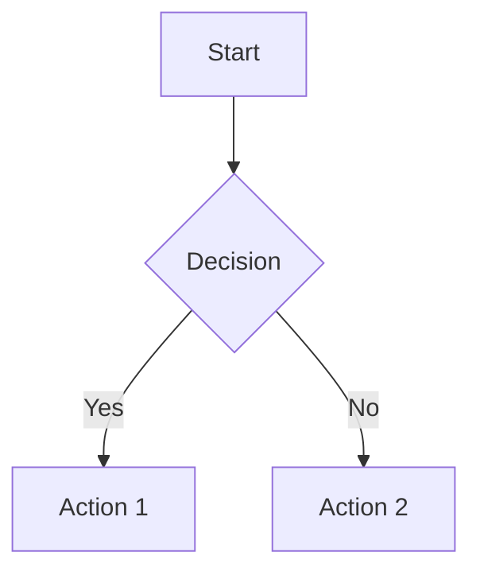
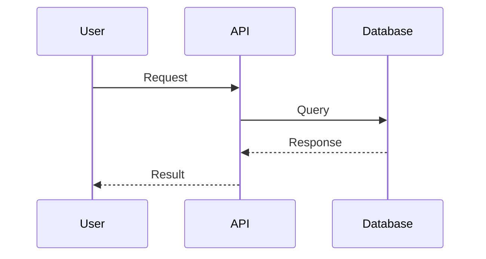
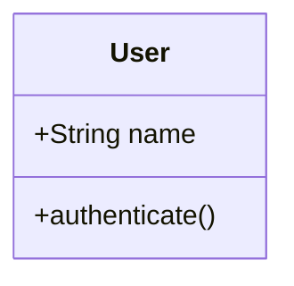
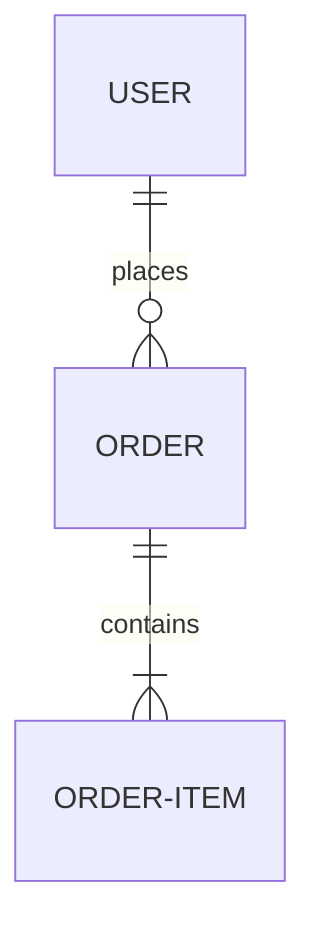

# mermaid-diagrams
You are given the following context:
$ARGUMENTS

Create Mermaid diagrams to visualize the provided code.

**Diagram Types to Generate:**

**1. Flowchart** (for process flows)

**2. Sequence Diagram** (for API interactions)

**3. Class Diagram** (for object relationships)

**4. Entity Relationship** (for database schemas)

**Instructions:**
1. Analyze the code structure
2. Identify key components and relationships
3. Choose appropriate diagram type(s)
4. Create clear, labeled diagrams
5. Add explanatory text for each diagram

Make diagrams easy to understand for both technical and non-technical stakeholders.